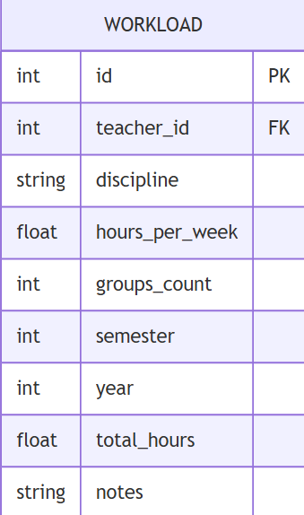

# Вариант №14

# Сервис расчета нагрузки преподавателя (Workload Calculation Service)

## Сущность: Workload (Нагрузка преподавателя)

### 1. Информация для создания сущности

| Параметр | Обязательность | Тип | Ограничение | Значение по умолчанию |
|----------|----------------|-----|-------------|-----------------------|
| `teacher_id` | Да | int | внешний ключ | — |
| `discipline` | Да | str | длина ≤ 200 | — |
| `hours_per_week` | Да | float | от 1 до 54 | — |
| `groups_count` | Да | int | от 1 до 10 | — |
| `semester` | Да | int | 1 или 2 | — |
| `year` | Да | int | от 2020 до 2030 | — |
| `total_hours` | Нет | float | вычисляемое поле | `hours_per_week * groups_count * 18` |
| `notes` | Нет | str | длина ≤ 500 | `None` |

**Уникальные комбинации параметров:**
- `teacher_id` + `discipline` + `semester` + `year` (один преподаватель не может вести одну дисциплину дважды в семестре)

**Формула расчета:**

---

### 2. Информация, возвращаемая при успешном создании

| Параметр | Тип |
|----------|-----|
| `id` | int |
| `teacher_id` | int |
| `discipline` | str |
| `hours_per_week` | float |
| `groups_count` | int |
| `semester` | int |
| `year` | int |
| `total_hours` | float |
| `notes` | str или `None` |

---

## Изменить сущность по ID

### 3. Информация для изменения сущности

| Параметр | Обязательность | Тип | Ограничение | Значение по умолчанию |
|----------|----------------|-----|-------------|-----------------------|
| `hours_per_week` | Нет | float | от 1 до 54 | текущее значение |
| `groups_count` | Нет | int | от 1 до 10 | текущее значение |
| `notes` | Нет | str | длина ≤ 500 | текущее значение |

> **Примечание:** Поля `teacher_id`, `discipline`, `semester`, `year` изменять нельзя. При изменении `hours_per_week` или `groups_count` автоматически пересчитывается `total_hours`.

### 4. Информация, возвращаемая при успешном изменении

| Параметр | Тип |
|----------|-----|
| `id` | int |
| `teacher_id` | int |
| `discipline` | str |
| `hours_per_week` | float |
| `groups_count` | int |
| `semester` | int |
| `year` | int |
| `total_hours` | float |
| `notes` | str или `None` |

---

## Удалить сущность по ID

**Возвращаемое значение:**
- `True` — если нагрузка была успешно удалена
- `False` — если нагрузка с указанным ID не найдена

---

## Получить сущность по ID

### 5. Информация, возвращаемая при успешном поиске

| Параметр | Тип |
|----------|-----|
| `id` | int |
| `teacher_id` | int |
| `discipline` | str |
| `hours_per_week` | float |
| `groups_count` | int |
| `semester` | int |
| `year` | int |
| `total_hours` | float |
| `notes` | str или `None` |

---

## Получить список сущностей по заданным параметрам

### 6. Параметры для получения списка

| Параметр | Тип | Описание |
|----------|-----|-----------|
| `teacher_id` | int | Фильтр по ID преподавателя |
| `discipline` | str | Поиск по названию дисциплины |
| `semester` | int | Фильтр по семестру (1 или 2) |
| `year` | int | Фильтр по году |
| `min_hours` | float | Минимальное количество часов в неделю |
| `mhours` | float | Максимальное количество часов в неделю |
| `min_ax_total` | float | Минимальная общая нагрузка |
| `max_total` | float | Максимальная общая нагрузка |
| `limit` | int | Максимум записей (по умолчанию 100) |
| `offset` | int | Пагинация (по умолчанию 0) |

### 7. Возвращаемый список сущностей

| Параметр | Тип |
|----------|-----|
| `id` | int |
| `teacher_id` | int |
| `discipline` | str |
| `hours_per_week` | float |
| `groups_count` | int |
| `semester` | int |
| `year` | int |
| `total_hours` | float |
| `notes` | str или `None` |

---

## ER-диаграмма

